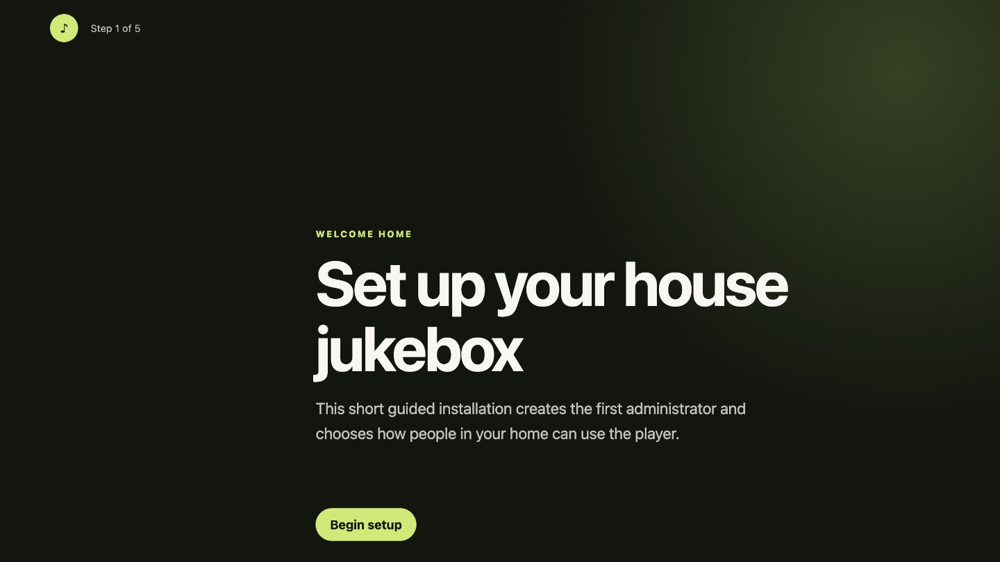
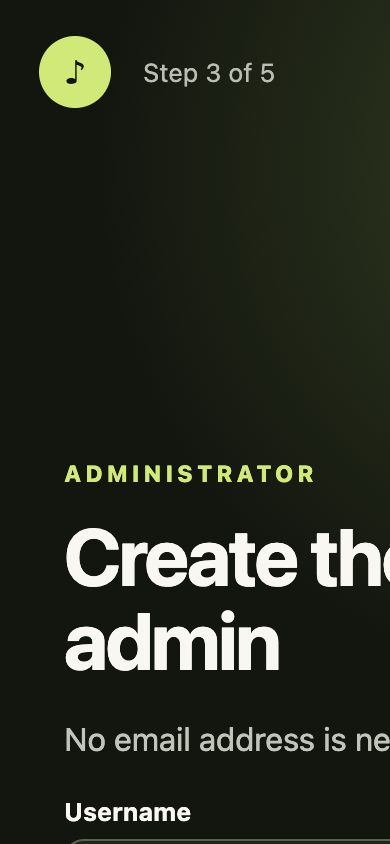

# House Jukebox

Turn a Raspberry Pi and an always-on speaker into a shared household jukebox.
The Pi owns playback; everyone else uses the responsive web app from a phone,
tablet, or computer. Queue music anonymously, create optional local accounts,
search YouTube, save radio stations, build playlists, and let auto-queue keep the
room playing.


## Why it is different

- **One speaker, many remotes.** Playback stays on the Raspberry Pi, so closing
  a phone or switching Wi-Fi does not stop the music.
- **Household-first access.** Anonymous queueing works in open mode. Accounts
  need only a username and password—never an email address.
- **Music context built in.** Artist photos, genres, biographies, related
  artists, listening history, and clickable discovery tags stay close to the
  queue.
- **A fair automatic DJ.** Auto-queue can rotate across active listeners, use
  chosen artists and genres, or continue from the last queued track.
- **Self-hosted and inspectable.** One Go binary, SQLite, structured logs, an
  init.d service, scripted regression tests, and no required cloud account.

## A guided first run

Fresh installations open a five-step, full-screen wizard that selects household
access, creates the first administrator, and optionally configures Last.fm.

| Desktop setup | Mobile setup |
| --- | --- |
|  |  |

No email or external identity provider is required. The administrator is signed
in immediately after setup.

## Features at a glance

- Anonymous shared queue with live Server-Sent Event updates
- YouTube URLs, integrated YouTube search, direct audio, and internet radio
- Raspberry Pi playback through `mpv`, with pause, resume, volume, and skipping
- Fair skip voting based on currently active household listeners
- Artist artwork, Last.fm tags, related artists, and genre discovery
- Recently played track history, including changing radio-stream metadata
- Favorite stations, personal playlists, and account taste dashboards
- Three-mode auto-queue with configurable depth
- Admin-only settings and local administrator role management
- Structured JSON/text logging with request IDs
- Guided setup, encrypted stored API keys, backup/restore tooling
- Automated stable releases and a rolling bleeding-edge build

| Personal listening | Household library |
| --- | --- |
|  |  |

## Quick start on a Raspberry Pi

The supported deployment target is 64-bit Debian 12 / Raspberry Pi OS on
ARM64. Development and cross-compilation happen on another machine; Go is not
required on the Pi.

1. Install playback and operational dependencies on the Pi:

   ```sh
   ./scripts/install-dependencies.sh
   ```

2. From the development machine, deploy over SSH:

   ```sh
   TARGET=user@jukebox.local make deploy-pi
   ```

3. Open `http://jukebox.local:8080` and complete the guided installation.

Existing `/etc/default/raspi-media-player` configuration and SQLite data are
preserved by upgrades. Read the full [installation guide](docs/installation.md)
before a first production deployment.

## Run locally

Requirements: Go 1.24+, `curl`, and `jq`. `mpv` and `yt-dlp` are needed only
when exercising their respective playback/search paths.

```sh
go run ./cmd/raspi-media-player \
  -addr 127.0.0.1:8080 \
  -db ./player.sqlite \
  -player-enabled=false
```

Open <http://127.0.0.1:8080>. To run the complete verification suite:

```sh
make check
make test-api
```

## Documentation

Start with the [documentation index](docs/README.md).

| Goal | Guide |
| --- | --- |
| Install and complete first run | [Installation](docs/installation.md) |
| Use the player, queue, discovery, and accounts | [Household user guide](docs/user-guide.md) |
| Configure the daemon and Admin UI | [Configuration reference](docs/configuration.md) |
| Operate, back up, restore, or uninstall | [Operations](docs/operations.md) |
| Integrate with HTTP/SSE endpoints | [API reference](docs/api.md) |
| Understand components and data flow | [Architecture](docs/architecture.md) |
| Develop and test changes | [Development](docs/development.md) |
| Diagnose failures | [Troubleshooting](docs/troubleshooting.md) |
| Choose stable or bleeding-edge builds | [Releases](docs/releases.md) |

Additional focused references cover [authentication](docs/authentication.md),
[auto-queue](docs/auto-queue.md), [artist enrichment](docs/enrichment.md),
[playback](docs/playback.md), [sources](docs/sources.md),
[logging](docs/logging.md), and [security](docs/security.md).

## Administration

The first wizard account is an administrator. Admins can manage household
access, playback, queue limits, metadata, skip voting, YouTube search,
auto-queue, retention, and other administrators. Secret settings are encrypted
before being stored in SQLite.


## Project status

The project is under active development. See [milestones.md](milestones.md) for
completed work and the active roadmap, and [RELEASE_NOTES.md](RELEASE_NOTES.md)
for current release scope and known limitations.
