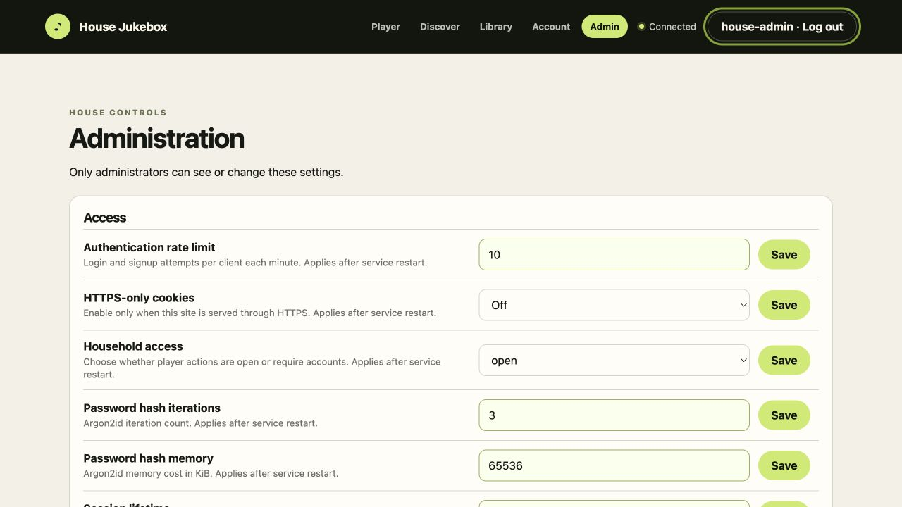

# Configuration reference

## Precedence

Startup defaults are loaded from `RASPI_MEDIA_PLAYER_*` environment variables,
then command-line flags override them. On the Pi, the init script sources
`/etc/default/raspi-media-player` and converts those values to flags.

Settings changed through Admin are stored in SQLite. Runtime components that
read settings dynamically apply them immediately; settings labeled “Applies
after service restart” are loaded into process configuration on the next start.
Operator-owned paths and logging bootstrap values remain read-only in Admin.

## Environment and flags

| Environment variable | Flag | Default / purpose |
| --- | --- | --- |
| `RASPI_MEDIA_PLAYER_ADDR` | `-addr` | `127.0.0.1:8080`; listen address |
| `RASPI_MEDIA_PLAYER_DB` | `-db` | `raspi-media-player.sqlite`; database path |
| `RASPI_MEDIA_PLAYER_LOG_FORMAT` | `-log-format` | `text`; `text` or `json` |
| `RASPI_MEDIA_PLAYER_LOG_LEVEL` | `-log-level` | `info`; debug/info/warn/error |
| `RASPI_MEDIA_PLAYER_QUEUE_LIMIT` | `-queue-limit` | `100` items |
| `RASPI_MEDIA_PLAYER_QUEUE_RATE` | `-queue-rate` | `20` anonymous mutations/minute |
| `RASPI_MEDIA_PLAYER_ACCESS_MODE` | `-access-mode` | `open` |
| `RASPI_MEDIA_PLAYER_AUTH_RATE` | `-auth-rate` | `10` login/signup attempts/minute |
| `RASPI_MEDIA_PLAYER_SESSION_DAYS` | `-session-days` | `30` days |
| `RASPI_MEDIA_PLAYER_SECURE_COOKIE` | `-secure-cookie` | `false`; set true behind HTTPS |
| `RASPI_MEDIA_PLAYER_ARGON_MEMORY_KIB` | `-argon-memory` | `65536` KiB |
| `RASPI_MEDIA_PLAYER_ARGON_ITERATIONS` | `-argon-iterations` | `3` |
| `RASPI_MEDIA_PLAYER_PLAYER_ENABLED` | `-player-enabled` | `false` in code, `true` in Pi defaults |
| `RASPI_MEDIA_PLAYER_PLAYER_BACKEND` | `-player-backend` | `mpv`; also `fake` for tests |
| `RASPI_MEDIA_PLAYER_MPV_BINARY` | `-mpv-binary` | `mpv` |
| `RASPI_MEDIA_PLAYER_MPV_SOCKET` | `-mpv-socket` | mpv IPC socket path |
| `RASPI_MEDIA_PLAYER_AUDIO_DEVICE` | `-audio-device` | `auto` |
| `RASPI_MEDIA_PLAYER_CACHE_SECONDS` | `-cache-seconds` | `20` seconds |
| `RASPI_MEDIA_PLAYER_PLAYER_RETRIES` | `-player-retries` | `1` retry |
| `RASPI_MEDIA_PLAYER_HISTORY_DAYS` | `-history-days` | `90`; zero disables pruning |
| `RASPI_MEDIA_PLAYER_METADATA_ENABLED` | `-metadata-enabled` | `true` |
| `RASPI_MEDIA_PLAYER_LASTFM_API_KEY` | `-lastfm-api-key` | optional API key |
| `RASPI_MEDIA_PLAYER_METADATA_CACHE_DAYS` | `-metadata-cache-days` | `7` days |
| `RASPI_MEDIA_PLAYER_METADATA_USER_AGENT` | `-metadata-user-agent` | descriptive contact string |
| `RASPI_MEDIA_PLAYER_METADATA_IMAGE_DIR` | `-metadata-image-dir` | image cache path |
| `RASPI_MEDIA_PLAYER_METADATA_MAX_INFLIGHT` | `-metadata-max-inflight` | `2` jobs |
| `RASPI_MEDIA_PLAYER_SETUP_REQUIRED` | `-setup-required` | `true` |
| `RASPI_MEDIA_PLAYER_SETTINGS_SECRET_KEY` | none | encryption bootstrap key |

Run `raspi-media-player -h` for the authoritative flag list for the installed
version.

## Admin UI settings

Settings are grouped into Access, Queue, Auto-queue, Playback, Library,
Metadata, Voting, YouTube, and Service. Admin validates booleans, enumerations,
numeric ranges, and seed lengths before storage.



Auto-queue adds four dynamic values: enabled state, strategy, seed artists, and
seed genres. Depth is 1–20; the active-session window is 30–3600 seconds.

Voting exposes enabled state, active-listener window, vote expiration, and
required percentage. YouTube exposes search enablement and result count.

## Secret handling

`lastfm_api_key` is a secret setting. The Admin API returns only whether it is
configured; it never returns plaintext. SQLite stores an AES-GCM envelope using
`RASPI_MEDIA_PLAYER_SETTINGS_SECRET_KEY`. Preserve that key with backups.

The defaults file should be owned by root and mode `0640`. Do not commit a real
provider key, setup key, SSH target, password, or copied defaults file.

## Validate and restart

On the Pi:

```sh
sudo raspi-media-player-service config-check
sudo service raspi-media-player restart
sudo service raspi-media-player status
```
