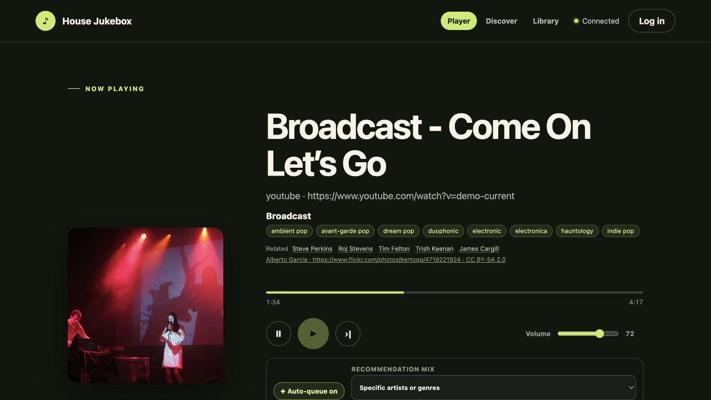
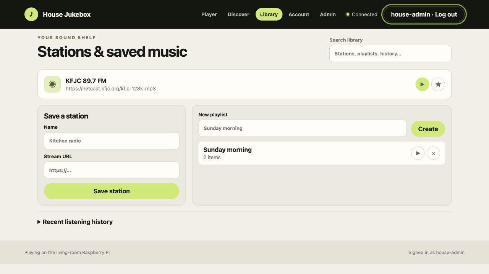
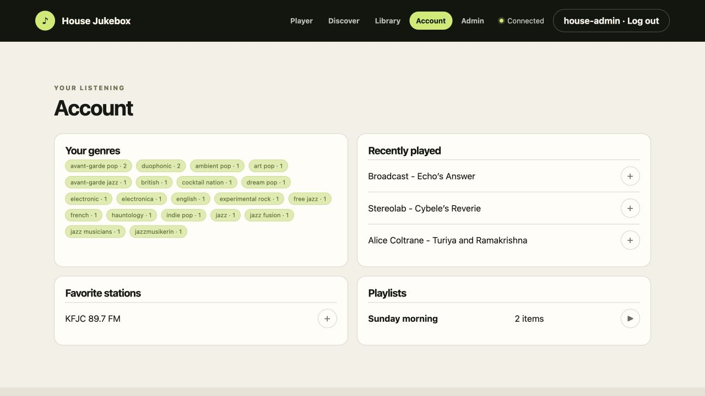

# Household user guide

## Player and queue

The Player screen shows the current track, source, artwork, genres, related
artists, progress, playback controls, auto-queue, and the shared queue. Updates
arrive over Server-Sent Events; a periodic poll provides recovery if a browser
misses an event.

To add music, choose **Open music search**. Enter either:

- an artist, song, or video search;
- a full YouTube URL;
- a direct HTTP(S) audio URL; or
- an internet-radio stream URL.

YouTube search results have a **Queue** button. Pasted URLs are queued directly.
Items can be reordered or removed from the Player screen. The Pi continues
playing independently of the browser that submitted them.

## Anonymous use and local accounts

In open mode, anonymous visitors can queue and control playback. A display name
may be associated with an anonymous submission, but no account is required.

Accounts are optional unless the administrator selects accounts-required mode.
Choose **Log in**, enter a username and password, and continue. If that username
does not exist in an account-creation-enabled mode, the app asks for the same
password again and immediately creates/signs in the local account. Accounts use
no email address and have no email recovery flow.

Signed-in users gain favorites, playlists, a private listening dashboard, and a
personal identity in history and the queue.

While a track is playing, press the heart button to add it to your listening
profile. This is useful for recommendations selected by auto-queue or submitted
by somebody else. Liked tracks appear on the Account screen, contribute to genre
counts, and influence the active-listener auto-queue strategy. Liking does not
interrupt playback or add a duplicate queue item.

## Skip voting

When skip voting is enabled, the skip control casts or withdraws a vote. The
status text updates immediately with votes required and active listeners. A
single active listener needs one vote; larger groups use the configured
percentage. Votes expire and reset when the current track changes.

## Artist and genre discovery

Genre chips in Now Playing, queue cards, and recent history are interactive.
Long artist biographies in Now Playing can be expanded in place with **Read
more** and collapsed again with **Show less**.
Selecting a genre opens Last.fm-backed artist and track lists. Each result can
launch a YouTube search inside the app. Artist and related-artist buttons open
the same discovery workflow.

Metadata is cached, so newly queued items may briefly show a loading shimmer
before artwork and tags appear. Queue refreshes preserve existing rows and do
not restart loaded artwork or animations unless queue content actually changes.

## Stations and playlists

The Library screen contains household stations, personal stations, favorites,
playlists, search, and recent listening history.

- Press play on a station to add it to the queue.
- Use the star to add or remove a favorite.
- Save a personal station with a name and stream URL.
- Create a playlist, then add compatible sources through the API/UI workflows.
- Queue an entire playlist from Library or Account.

## Account dashboard

The Account screen summarizes genres computed from enriched personal history,
recently played tracks, favorite stations, and playlists. The plus/play buttons
queue content directly from the dashboard.

## Auto-queue

Auto-queue keeps a configured number of tracks waiting behind the current item.
Use the controls under Now Playing to enable it and select one strategy:

- **Active listeners · fair rotation** chooses one active signed-in listener at
  a time. The least recently represented listener wins; ties are random. Turns
  persist across restarts.
- **Specific artists or genres** uses comma-separated seed fields from the
  Player screen.
- **Related to last queued item** uses cached tags and similar artists from the
  final queue item.

Manual queue items are never removed or reordered by auto-queue. See
[auto-queue.md](auto-queue.md) for algorithm and failure behavior.

## Mobile behavior

The interface is responsive. On small screens the current artist image becomes
a darkened background banner behind readable metadata, primary navigation moves
to the bottom, forms stack vertically, and the queue keeps controls reachable.
Reduced-motion browser preferences disable nonessential transitions.
